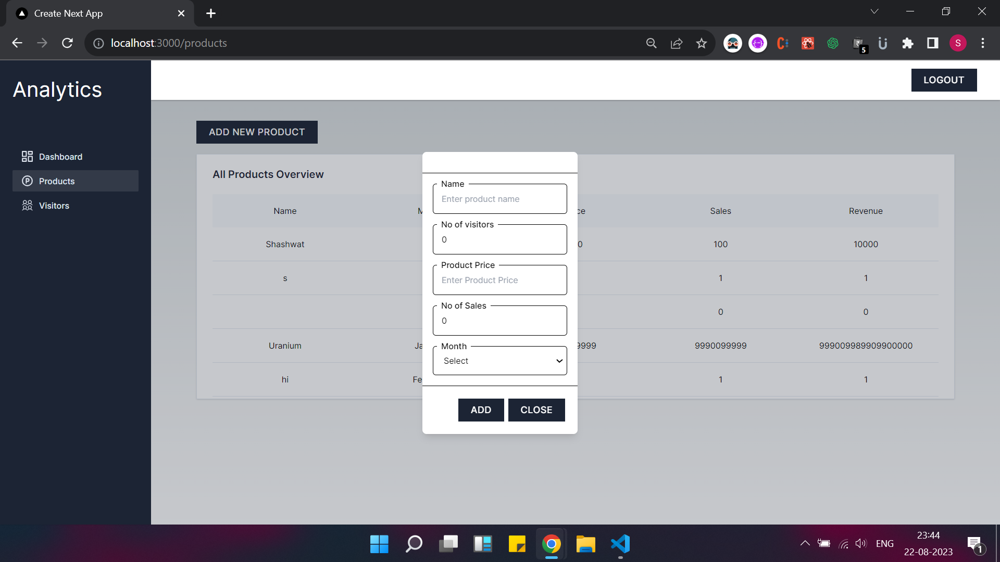

## Getting Started

First, run the development server:

npm run dev

Open at port 3000
not on any other port otherwise backend will not work

    !!!Images!!!

Google Signin

Admin Dashboard Page

Product Page

Add Product Modal

Visitor Page

Add Visitor Modal